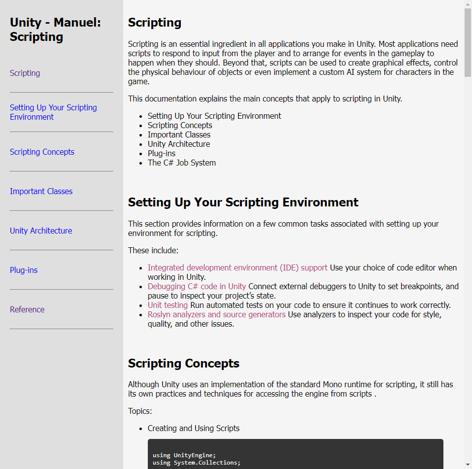
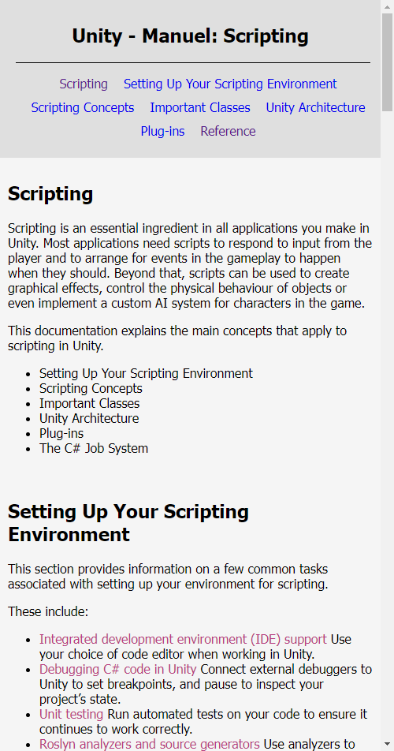

# TechnicalDocumentationPage
This is one of the required projects to earn freeCodeCamp's Responsive Web Design Certification.

For this project, the goal is to build a technical documentation page to serve as instruction or reference for a topic.

🚀 You can access the site at https://cey-s.github.io/TechnicalDocumentationPage/

**Preview:**

